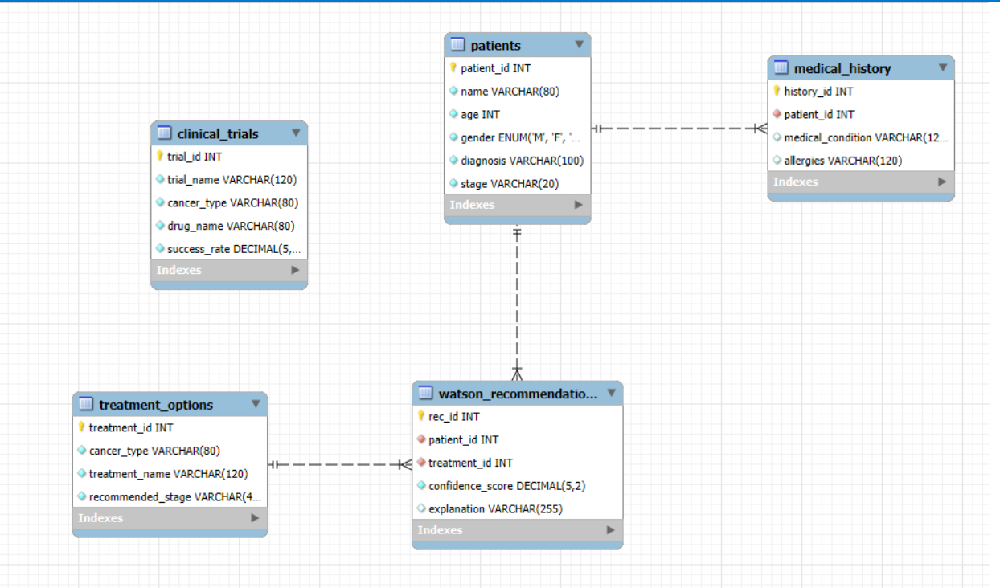

# 🏥 Healthcare SQL Case Study – IBM Watson Oncology

## 📌 Project Overview
This project simulates **IBM Watson’s Oncology Treatment Recommendation System** using SQL.  
It demonstrates how healthcare data can be structured, stored, and analyzed to support **personalized cancer treatment** decisions.

The case study includes:
- 📂 Database schema (DDL + DML with sample data)
- 📊 15–20 SQL queries (Easy → Medium → Hard)
- 🔗 ER Diagram showing relationships
- 📘 Documentation of insights

---

## 🗄️ Database Schema
The project database consists of **5 core tables**:

1. **Patients** 🧑‍⚕️ – stores patient details  
2. **Medical_History** 📋 – conditions & allergies of patients  
3. **Treatment_Options** 💊 – available treatment methods  
4. **Clinical_Trials** 🧪 – ongoing clinical trials  
5. **Watson_Recommendations** 🤖 – IBM Watson’s treatment suggestions with confidence score  

---

## 🔑 Primary & Foreign Key Relationships
- `Patients.patient_id` → `Medical_History.patient_id`  
- `Patients.patient_id` → `Watson_Recommendations.patient_id`  
- `Treatment_Options.treatment_id` → `Watson_Recommendations.treatment_id`  
- `Clinical_Trials.trial_id` → `Watson_Recommendations.trial_id`  

---

## 📊 ER Diagram



---

## ⚡ Example Queries
Here are some sample queries included in the project:

```sql
-- 1. Show all patients and their diagnosis
SELECT name, diagnosis FROM Patients;

-- 2. Count patients by cancer stage
SELECT stage, COUNT(*) AS total_patients
FROM Patients
GROUP BY stage;

-- 3. Show patients recommended for treatment with confidence > 85
SELECT p.name, t.treatment_name, wr.confidence_score
FROM Patients p
JOIN Watson_Recommendations wr ON p.patient_id = wr.patient_id
JOIN Treatment_Options t ON wr.treatment_id = t.treatment_id
WHERE wr.confidence_score > 85;


---

## 🙌 Acknowledgements
Inspired by **IBM Watson Health** and its efforts to transform cancer care using **AI-driven treatment recommendations**.  

---

✨ *Made with SQL for Healthcare Data Analytics* ✨


